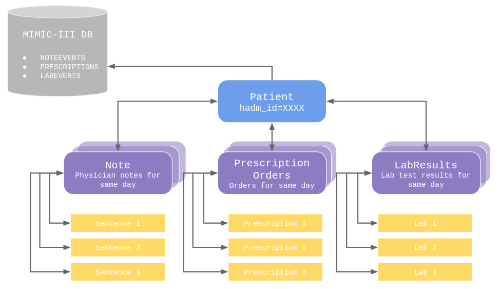

# OpenNotes: ConflictClassifier

ConflictClassifier is an end-to-end rule-based pipeline that: 

1) takes unstructured notes and structured table data as input and extracts candidate sentence pairs for comparison, and 

2) classifies whether the sentence pairs contradict.

We integrate domain-specific knowledge bases, such as UMLS and RxNorm ontologies, for candidate sentence extraction, and construct domain-specific features for rule based classification. We use the [MedNLI](https://physionet.org/content/mednli/1.0.0/) dataset and construct a dataset from [MIMIC-III](https://mimic.physionet.org/). We also compare against non-rule based baselines from [Romanov and Shivade](https://arxiv.org/abs/1808.06752), which give insights into simple, interpretable models versus more complex, black-box models, especially in the context of limited data. 

## Installation

Using `conda`, set up a virtual environment with `environment.yml` and activate, e.g. 

```
# creates virtual environment and installs dependencies
conda env create -f environment.yml

# activates opennotes venv
conda activate opennotes
```

## Loading MedNLI and MIMIC-III

After getting access to MedNLI and MIMIC-III data through PhysioNet, use `gsutil` command to copy MIMIC-III tables from Google Cloud Storage Bucket to your local or virtual machine, and download MedNLI directly from [here](https://physionet.org/content/mednli/1.0.0/).

```
# authenticate, this should direct you to a link; 
# click on account linked to PhysioNet and 
# copy+paste authentication code to verify credentials
gcloud auth login 

# copy files (mimic-iii)
gsutil cp gs://mimiciii-1.4.physionet.org/NOTEEVENTS.csv.gz .
gsutil cp gs://mimiciii-1.4.physionet.org/PRESCRIPTIONS.csv.gz .
gsutil cp gs://mimiciii-1.4.physionet.org/LABEVENTS.csv.gz .
gsutil cp gs://mimiciii-1.4.physionet.org/D_LABITEMS.csv.gz .
```

## Data Processing

We process the MIMIC-III tables and MedNLI dataset to generate dataset with sentence pairs to check for contradiction, and a label (if it has been labeled). We describe the notebooks below.

### MIMIC-III

To process datasets from the MIMIC-III database (hand-labeled, generated contradiction, and unlabeled), run `MIMIC Data Processing + Contradiction Generation.ipynb`. We describe the main parts of the notebook:

* **Part 1:** Sets up concept extractors using spaCy and scispaCy packages. Specifically, we use spaCy with UMLS and RxNorm entity linkers and Med7 model. 

* **Part 2:** Describes the conflict types we are interested in and mappings to semantic types, which can be derived from UMLS entity linker. 

* **Part 3:** Loads MIMIC-III data tables.

* **Part 4:** Code used to generate contradictions. We print outputs from the first part of pipeline that filters for candidate sentence pairs talking about the same topic, then insert contradictions. 

* **Part 5:** Once contradictions are generated, create dataset for baseline and rule-based models.

* **Part 6:** Creates dataset for hand-labeled MIMIC-III examples for baseline and rule-based models.

* **Part 7:** Creates dataset for unlabeled MIMIC-III examples for qualitative evaluation.

### MedNLI 

To process datasets from MedNLI dataset, run `MedNLI Data Processing.ipynb`. Parts 1-2 are similar to the MIMIC-III data processing notebook. Part 3 creates dataset for baseline and rule-based models.  

## Experiments

### MedNLI

instructions on how to reproduce results - e.g. run this code to reproduce table X/experiment A results

#### Baseline

todo, @diana

#### Rule-Based 

todo, @sharon

### MIMIC-III

instructions on how to reproduce results - e.g. run this code to reproduce table X/experiment A results

#### Baseline

todo, @diana

#### Rule-Based 

todo, @sharon

## Considerations for Demo



To make the pipeline easily integrate-able to a demo, our main consideration was ensuring we can map sentences back to the original patient so that if a potential contradiction is detected, we can trace back to the original patient and highlight the sentence in the note. 

We developed 3-tiered data representation, as shown in the figure above, which is implemented in `data_structures.py`. It consists of `Patient`, `DailyData`, and `Data` classes for each tier. `DailyData` subclasses include `Note`, `PrescriptionOrders`, and `LabResults`; `Data` subclasses include `Sentence`, `Prescription`, and `Lab`. 

In our pipeline, initializing a `Patient` instance constructs a 3-tiered tree with bidirectional edges between nodes so that we can trace back from, e.g. a `Sentence` instance to `Patient`. 

